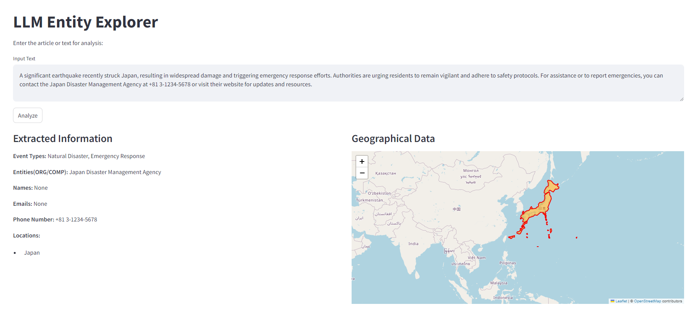

# LLM Entity Explorer

## Overview
The **LLM Entity Explorer** is an advanced Python application designed for processing and analyzing textual data. By utilizing cutting-edge natural language processing (NLP) techniques, this application extracts valuable insights from text, including event types, entities, names, emails, phone numbers, and geographical data. It incorporates **DeepInfra's** prompt engineering to enhance the interaction with language models, ensuring more accurate and contextually relevant information extraction.


## Features
- **Comprehensive Text Analysis**: 
  - Extracts various components from input text, such as event types and entities, providing users with structured and actionable insights.
  
- **Geolocation Integration**: 
  - Visualizes geographical locations mentioned in the text, allowing users to understand the context better and make data-driven decisions.

- **User Interfaces**: 
  - Offers both a command-line interface (CLI) for quick analysis and a web interface built with **Streamlit** for a more interactive and user-friendly experience.

- **Data Visualization**: 
  - Generates dynamic geographical visualizations based on extracted locations, making it easy to explore and analyze spatial data.

- **Robust Error Handling**: 
  - The application is designed with comprehensive error handling to ensure smooth operation and user experience, providing informative logs for troubleshooting.


# Signing Up for DeepInfra API Access

To utilize DeepInfra’s advanced API features, follow these steps:

1. Visit the DeepInfra Website: Go to DeepInfra's official site (https://deepinfra.com/).

2. Create an Account:

    - Click on the "Sign Up" button.
    - Fill in the required details, including your name, email address, and password.
    - Agree to the terms and conditions and submit the form.

3. Verify Your Email:

    - Check your email for a verification link from DeepInfra. Click the link to verify your email address.

4. Log In to Your Account:

    - Return to the DeepInfra website and log in using your credentials.

5. Access the API Documentation:

    - Navigate to the API section in your dashboard to find the documentation that outlines how to interact with the API.

6. Obtain Your API Key:

    - In the API section, you will find an option to generate your API key. Keep this key secure, as it is necessary for authenticating your requests.

## Installation
To run the application, ensure you have **Python 3.x** installed. Follow the steps below to set up the environment and install the required packages:


1. **Clone the Repository**:
```
git clone https://github.com/YourUsername/LLM-EntityExplorer.git
cd LLM-EntityExplorer
```

2. **Set Up the Virtual Environment**:
```
python -m venv .venv  
.\.venv\Scripts\activate
```

3. **Install Required Packages**:
```
pip install -r requirements.txt
```

4. **LLM models used**:
The application leverages the following large language models for enhanced performance:
```
- microsoft/WizardLM-2-8x22B
- meta-llama/Meta-Llama-3.1-70B-Instruct
```

## Usage

**Running the Application**
You can run the application using either the command-line interface (CLI) or the Streamlit web interface.

**Command-Line Interface**
To use the CLI, execute the following command:
```
python app.py
```

**Streamlit Interface**
To start the Streamlit web application, run:
```
streamlit run app.py
```


## Example Usage
After launching the application, you can input a piece of text for analysis. The application will process the text and provide structured output, including extracted entities, event types, and geographical data.

## Expected Output

- Event Types: Types of events identified in the text.
- Entities: Organizations or companies mentioned.
- Names: Personal names extracted.
- Emails and Phone Numbers: Contact details found in the text.
- Geographical Data: Visual representations of locations.




# Contributing
Contributions are welcome! If you have suggestions for improvements or new features, please submit a pull request or open an issue in the GitHub repository.

# License
This project is licensed under the MIT License. See the LICENSE file for details.

# Acknowledgements
Special thanks to the creators of the models used in this application and the contributors who help enhance its capabilities. Additionally, gratitude is extended to DeepInfra for their innovative prompt engineering techniques that significantly improve the application's performance.

